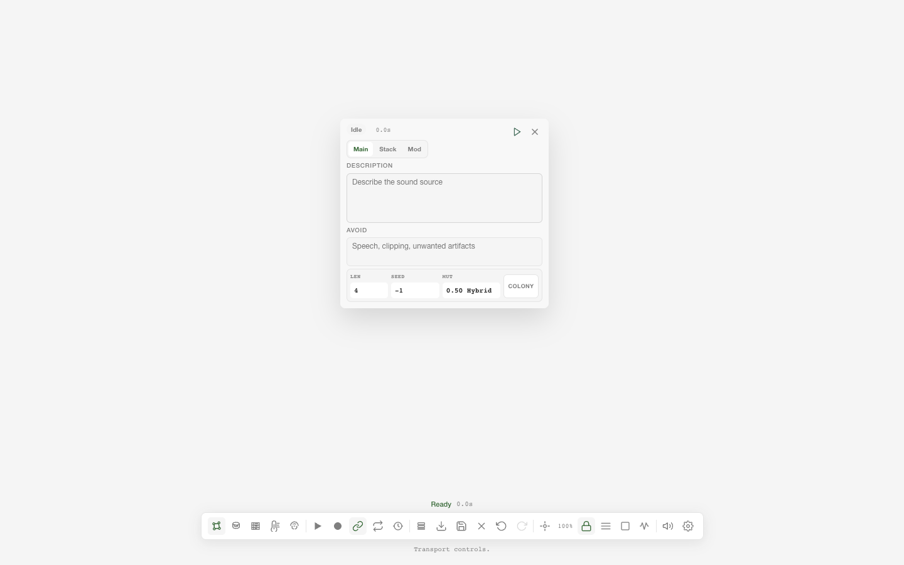

# GERM

> **Public alpha · Open research release · Local-first · Open-source · Under active development**

GERM is a local cultivation environment for generative microsound. It treats
sound as material that can be generated, granulated, grafted, mutated,
listened to, and traced through lineage. A listening from Oída can become a
prompt or source in GERM; a successful render can become a descendant in
Akousmata and return to Oída for another listening.

Current release: `0.3.2`.

GERM is an independent Sonic Field Labs project. It can use Stable Audio 3
providers, but it is not an official Stability AI product.

The Listening Stack remains model-agnostic at its contracts. GERM's first
fully developed local generation path is more specific: it is designed around
Stable Audio 3 and uses its text-to-audio, audio-to-audio, inpainting,
continuation, variable-length, and LoRA primitives as material for cultivation.
The upstream code is MIT; the currently released local weights are gated and
carry separate Stability AI and component terms.



## Try It Without a Model

The default mock provider exercises the dashboard, graph, jobs, metadata,
lineage, and WAV-writing path without downloading a model:

```bash
uv sync --extra dev
./launch_germ.command
```

Open `http://127.0.0.1:5178/dashboard`. The mock provider emits a test signal,
not model-generated sound, so it is safe for installation and integration
checks but not a creative quality demonstration.

## What You Can Do

- Generate or transform sound through mock, local Stable Audio 3 Python,
  Apple Silicon MLX, or opt-in Stability API providers.
- Build a modular graph across grains, cells, swarms, tissues, controls,
  effects, and a realtime Chamber.
- Use local Cosmoaudition observations as attributed modulation and event
  material through explicit mappings, archives, and missing-data policies.
- Measure spectral, temporal, spatial, and morphological properties with
  Matter Analysis while keeping measurements, inference, and unavailable
  states distinct.
- Graft, inpaint, continue, compare, mutate, record, and collect sound while
  retaining prompts, seeds, models, parameters, parents, and operations.
- Import an Oída listening as sound, prompt, or lineage and ask Oída to listen
  to a cultivated result again.
- Write a successful generation to the shared Akousmata store only when
  requested.

## Requirements

| Path | Operating system | Hardware and software |
| --- | --- | --- |
| Mock service | macOS or Linux | Python 3.10+, `uv`; CPU only; no weights |
| Stable Audio 3 Small, MLX | Apple Silicon macOS | Official `sa3` optimized tools and separately accepted Small SFX or Small Music weights |
| Stable Audio 3 Small, Python | macOS or Linux | Upstream CPU path or compatible acceleration; 8 GB minimum and 16 GB system RAM suggested |
| Stable Audio 3 Medium, Python | Linux/NVIDIA | Compatible CUDA GPU; upstream reports about 6.52 GB peak VRAM, while GERM suggests 24 GB system RAM |
| Stability API | Any service-supported system | Network access, an operator-owned account, API key, and acceptance of service terms |
| Native shell | macOS 13+ | Swift 5.9/Xcode command-line tools; the Python service still performs all audio work |

Model access, RAM or VRAM use, and generation time vary substantially by
checkpoint and provider. GERM reports provider diagnostics rather than
promising one universal hardware minimum.

## Release Guide

| Question | Where to begin |
| --- | --- |
| How does it work? | [Micro/Matter architecture](docs/germ_micro_architecture.md) and [provider design](docs/provider_design.md) |
| How does it connect? | [The Listening Stack](https://sonicfield.org/stack) and [Oída integration](docs/oida-integration.md) |
| How do I install a tested model? | [Local model setup](docs/local_setup.md) |
| Which models and licenses apply? | [Models and licensing](docs/models-and-licensing.md) |
| What is unfinished? | [Known limitations](#known-limitations) and [roadmap](ROADMAP.md) |
| How can I help? | [Contribution guide](CONTRIBUTING.md) |
| How should I cite it? | [CITATION.cff](CITATION.cff) |

## What works

- Text-to-audio generation, seed/batch variation, audio-to-audio grafting,
  inpainting, continuation, layer comparison, and source handoff.
- Mock, Stable Audio 3 Python, Stable Audio 3 MLX, and Stability API provider
  routes with readiness diagnostics and cancellable jobs.
- A browser dashboard and native macOS shell over the same FastAPI server and
  server-owned session graph.
- Realtime Chamber audio with granular and envelope-follower AudioWorklets,
  pooled trigger voices, smoothed master gain/FX updates, headroom management,
  compression, soft clipping, and WAV recording.
- Micro/Matter modules for grains, cells, swarms, membranes, spectral tissue,
  quanta, microscope analysis, saved matter profiles, biomes, and incubated
  evolution.
- A separate Cosmoaudition module category with cosmic, Earth, biosphere,
  human-machine, relational, event, semantic, uncertainty, archive, mapping,
  and matter-processing modules.
- Optional MASA 0.1 sidecars for successful generations and Matter Analysis
  artifacts. Sonic Lineage `sound_id` remains GERM's canonical identity.
- Wavetable Forge conversion, prompt, mutation, render, import/export, and
  audition routes.
- LoRA loading and a persistent Strain registry for adapter identity,
  intensity, tags, licensing, and provenance.
- Audio-to-control analysis, bounded OSC, MIDI intent, CV-safe exports, and a
  norns/Fates bridge.
- Local library, Herbarium, waveform player, metadata preview, path-safe file
  operations, and generation lineage.
- OÍDA re-listening and prompt derivation. GERM performs bounded local signal
  checks; OÍDA owns machine listening and audio understanding.

## Scales

| Scale | Unit | Representative modules |
| --- | --- | --- |
| Micro | grain, cell, quanta | Grain Culture, Cell Splitter, Quanta, Microscope |
| Meso | colony, tissue, swarm | Particle Engine, Swarm, Colony, Spectral Tissue |
| Macro | organism, culture, graph | Chamber, Genetic Matrix, controllers, performance |

All three scales use the same module graph, semantic FX bridge, sessions,
library, and lineage model.

## Sonic Matter Observatory integration

GERM keeps the Observatory components distinct while making their contracts
usable inside the cultivation graph:

| Component | Boundary in GERM |
| --- | --- |
| MASA 0.1 | Optional descriptive JSON sidecars under `output/masa/`; never replaces Sonic Lineage or changes a successful render into a failure. |
| MATERIA | Matter Analysis provides a bounded local analyzer informed by the shared measured / inferred / unavailable distinction; it is not a claim of listening. |
| Cosmoaudition System | A loopback-only, response-bounded HTTP bridge reads snapshots and source status. GERM never contacts observatory providers directly. |

Cosmoaudition mappings are operator-authored control relations. They do not
claim that a dataset is the literal voice or identity of a source. Missing or
unfetched observations do not silently become zero or a neutral modulation;
the route remains inactive until its state is explicit.

## Listening Stack integration

**Oída hears. GERM cultivates. Akousmata remembers. AKOÚŌ structures. Earworm
routes.** Together they form
[The Listening Stack](https://sonicfield.org/stack), open infrastructure for
listening, re-listening, sonic memory, and cultivation.

| Component | Version / contract | GERM integration |
| --- | --- | --- |
| [OÍDA](https://github.com/sonicfieldlabs/oida) | 0.9.1 / `oida/gateway/v0.5` | Re-listen to generated sound, derive editable prompts, and retain a listening only when requested. |
| [Earworm](https://github.com/sonicfieldlabs/earworm) | 0.6.0 / akousma spec v1.5 | Export generation context and preserve provenance, lineage, location/capture, and covenants. |
| [Akousmata](https://github.com/sonicfieldlabs/akousmata) | 0.6.0 | Import remembered sound, prompt, or lineage; write successful generations back as child akousmata. |
| [AKOÚŌ](https://github.com/sonicfieldlabs/akouo) | 0.9.0 / `akouo/v0.9` | Keeps listening claims, evidence permissions, apparatus, temporal passes, and covenants consistent across the stack. |
| [Algophony](https://github.com/sonicfieldlabs/algophony) | 0.5.1 | Can evaluate lineage-bearing generation batches without changing GERM's generation state. |
| [ORAM](https://github.com/sonicfieldlabs/oram) | 0.4.1 | Uses the local GERM-compatible generation surface for constrained sound summoning and transformation. |

The core handoff is:

```text
Sound → Oída hears → GERM cultivates → Akousmata remembers
          ↑                 |                    |
          +------------- listen again -----------+

AKOÚŌ structures claims and routes. Earworm routes events,
provenance, retention, and lineage between the organs.
```

## Install

For a guided GERM or complete Listening Stack installation, including model
choice, storage and memory guidance, gated-access checks, downloads, and local
gateway configuration:

```bash
curl -fsSL https://raw.githubusercontent.com/sonicfieldlabs/listening-stack/main/install.sh | bash
```

Choose **GERM only** or **Oída + GERM** in the terminal assistant. GERM remains
in this repository; the installer only coordinates its source, dependencies,
provider, models, and local configuration.

Requirements: Python 3.10+ and `uv`.

```bash
uv sync --extra dev
```

Install a local Stable Audio provider only when needed:

```bash
uv sync --extra python-provider
./scripts/install_mlx_provider.sh       # Apple Silicon route
```

Provider model repositories and weights remain outside Git. See
[local setup](docs/local_setup.md) and
[provider design](docs/provider_design.md).

## Run

```bash
./launch_germ.command
```

Open `http://127.0.0.1:5178/dashboard`.

Server only:

```bash
./scripts/run_server.sh
```

Native macOS shell:

```bash
apps/macos/script/build_and_run.sh
```

The shell embeds the same dashboard and supervises the same daemon. It does
not maintain a second session or generation state.

Health and diagnostics:

```bash
curl http://127.0.0.1:5178/health
curl http://127.0.0.1:5178/diagnostics
```

## Core API

The complete request and response contract is in
[docs/api_reference.md](docs/api_reference.md). Principal route groups:

| Group | Routes |
| --- | --- |
| Generation | `/generate`, `/audio-to-audio`, `/inpaint`, `/continue`, `/jobs/*` |
| Models | `/models`, `/models/load`, `/diagnostics`, `/huggingface/status` |
| Listening | `/listener/enhance`, `/listener/score`, `/listener/relisten` |
| Memory | `/earworm/export`, `/import`, `/akousma/*` |
| Micro/Matter | `/micro/matter-profile`, `/matter/analyze`, `/micro/matter-analysis`, `/micro/biomes/*` |
| Cosmoaudition | `/cosmoaudition/status`, `/cosmoaudition/modules`, `/cosmoaudition/sources`, `/cosmoaudition/snapshot`, `/cosmoaudition/map`, `/cosmoaudition/archives/*` |
| Strains | `/strains/*`, `/lora/load`, `/lora/strength` |
| Wavetables | `/wavetables/*` |
| Control | `/control/*` |
| Sessions | `/sessions`, `/sessions/current`, `/sessions/{id}` |
| Files/library | `/library`, `/files/*` |

Example mock generation:

```bash
curl -X POST http://127.0.0.1:5178/generate \
  -H "content-type: application/json" \
  -d '{
    "provider": "mock",
    "model": "mock-sine",
    "prompt": "dry close-microphone loop of metallic friction",
    "negative_prompt": "speech, vocals, melody, long reverb",
    "duration": 3.0,
    "steps": 8,
    "cfg_scale": 1.0,
    "seed": -1,
    "output_name": "metal_friction_sprout",
    "tags": ["SFX", "loop", "texture"]
  }'
```

## Provider and data boundaries

- The default provider is `mock`; no model or weight is downloaded
  implicitly.
- Local input, output, model, upload, and duration limits are configured in
  `.env.example`.
- Hosted generation and cloud vision remain opt-in. Credentials are read from
  the process environment and are never stored in generation metadata.
- The server binds to loopback and validates Host/Origin headers by default.
- Generated audio, metadata, uploads, sessions, strains, model weights, build
  products, and local app state are ignored by Git.
- A generation written to Akousmata records only portable identifiers and
  relative/protocol-safe provenance. Machine-specific paths stay local.

## Known Limitations

- This is a public alpha. Session, graph, and provider interfaces can still
  change before 1.0 even though public contracts are documented.
- Jobs are held in memory. A server restart loses job state, while completed
  WAV and metadata files remain on disk.
- A queued Python-provider job can be cancelled, but an in-process render may
  finish because the upstream API has no safe mid-render interrupt. MLX
  subprocess jobs support active cancellation.
- Real-model access is separately licensed and may be gated. Output quality,
  latency, determinism, and hardware use vary by provider and checkpoint.
- The native macOS shell is built locally and is unsigned by default.
- Physical CV output is disabled. MIDI may use browser Web MIDI or an optional
  configured local backend; otherwise the server records intent only.
- Hosted routes are explicit opt-ins and can send prompts, source audio, or
  derived material to their provider. The default mock route stays local.
- GERM performs bounded signal checks but does not replace Oída's listening and
  claim-accountability layer.
- Cosmoaudition live data requires the separate local Cosmoaudition System;
  fixture mode and archived observations remain available without granting
  GERM direct provider access.

The [roadmap](ROADMAP.md) identifies current research priorities and non-goals.

## Development

```bash
uv run pytest -q
uv run ruff check server tests
node --check dashboard/static/app.js
node --check dashboard/static/dish.js
node scripts/smoke_dashboard.mjs
```

## Documentation

- [API reference](docs/api_reference.md)
- [Architecture of Micro/Matter](docs/germ_micro_architecture.md)
- [Stable Audio integration](docs/stable-audio-integration.md)
- [OÍDA and Akousmata integration](docs/oida-integration.md)
- [Provider design](docs/provider_design.md)
- [Local setup](docs/local_setup.md)
- [Native macOS shell](docs/macos-shell.md)
- [Troubleshooting](docs/troubleshooting.md)
- [Models and licensing](docs/models-and-licensing.md)
- [Public roadmap](ROADMAP.md)
- [Changelog](CHANGELOG.md)

## License

MPL-2.0. See [LICENSE](LICENSE).
